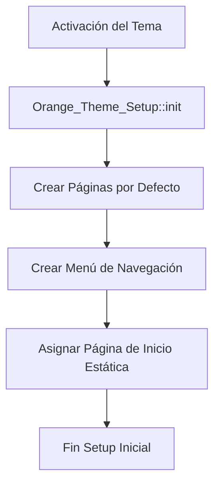

# 02_SDD.md — Diseño del Sistema

## 1. Arquitectura del Tema
El tema sigue la estructura estándar de WordPress, pero centralizando la lógica de auto-configuración y assets limpios.

```
wp-content/themes/orange-latam/
├── assets/
│   ├── css/
│   │   └── style.css       # Estilos globales y específicos
│   └── js/
│       └── main.js         # Lógica interactiva (Vanilla JS)
├── inc/
│   └── class-theme-setup.php # Lógica de auto-inicialización de páginas, menús y settings
├── template-parts/
│   ├── header-nav.php
│   ├── section-hero.php
│   ├── section-stats.php
│   ├── section-nosotros.php
│   ├── section-servicios.php
│   ├── section-premios.php
│   ├── section-sectores.php
│   ├── section-expertos.php
│   ├── section-contacto.php
│   └── footer-content.php
├── footer.php
├── header.php
├── index.php               # Carga la primera vista (maquetado estático/dinámico)
├── functions.php           # Encola scripts/estilos e incluye inicializadores
└── style.css               # Metadatos del tema
```

## 2. Flujo de Auto-Configuración
Al activar el tema, se dispara la clase `Orange_Theme_Setup` en el hook `after_switch_theme`:



- **Páginas a verificar/crear:**
  - `Inicio` (slug: `mejor-agencia-de-comunicacion-y-relaciones-publicas-en-peru`)
- **Menú de navegación:**
  - Nombre: "Menú Principal Orange"
  - Ubicación: `primary`
  - Elementos vinculados a los anclajes de las secciones (`#inicio`, `#nosotros`, `#servicios`, `#premios`, `#contacto`).
- **Configuración de WordPress:**
  - `show_on_front` = `'page'`
  - `page_on_front` = ID de la página `Inicio`.
